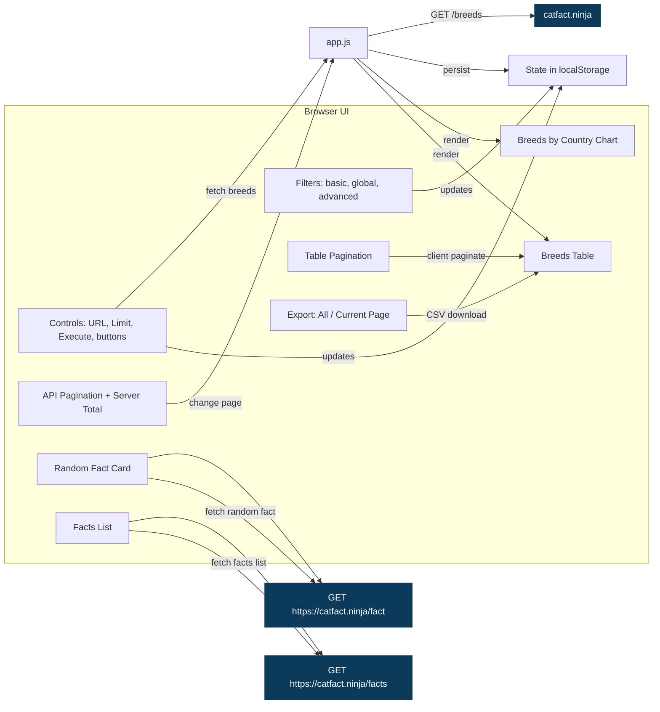

# Cat Breeds Visualizer

A lightweight, static web app to fetch and visualize cat breed data and facts from catfact.ninja.

<details open>
  <summary><strong>Table of contents</strong></summary>

- [Features](#features)
- [Live demo](#live-demo)
- [Quick start](#quick-start)
- [How to use](#how-to-use)
- [Keyboard shortcuts / Quick tips](#keyboard-shortcuts--quick-tips)
- [Notes](#notes)
- [Privacy](#privacy)
- [Architecture (Mermaid)](#architecture-mermaid)
- [Project structure](#project-structure)
- [Development](#development)
- [Testing](#testing)
- [Troubleshooting](#troubleshooting)
- [License](#license)

</details>

## Features
- Fetch breeds from any compatible endpoint (default: https://catfact.ninja/breeds)
- Clear separation of pagination:
  - API pagination controls (Prev/Next API Page) with server total indicator when available
  - Client-side table pagination (Rows per page 10/25/50/100)
  - Auto-increase server limit when you choose a larger table page size (e.g., 100) so the table can actually show that many rows
- Controls and error handling:
  - Request URL, Limit, Use 50 per page, Use 100 per page, Execute
  - Load default, clear history and execute (resets filters/local settings, loads defaults)
  - Execute loads exactly the Request URL; Load Data applies current Limit and resets page=1
  - If a request fails or returns no data, the app offers to load the default 50
- Filters and search:
  - Fuzzy filters (Breed, Country), Global search, Advanced per-field filters with AND/OR logic, Active filter chips
- Interactive table:
  - Sorting by column; table pagination; Export CSV (all filtered rows) and Export Current Page (only visible rows)
  - Tooltips explain export scope
- Chart: Breeds by Country (Chart.js)
- Random Cat Fact with optional auto-refresh and max fact length
- Facts list (GET /facts) with pagination, max_length filter, and CSV export
- Settings persisted locally (URL, headers, filters, sort, pagination, auto-refresh)

## Live demo
- GitHub Pages: https://crazycyke.github.io/cat-breeds-visualizer/
- If the URL changes, check your repository’s Pages settings for the current address.

## Quick start
- Option A: Open index.html directly in a modern browser.
- Option B: Serve locally (recommended for GitHub Pages parity):
  - Python: `python3 -m http.server 8080`
  - Node (if installed): `npx http-server -p 8080`
  - Then open http://localhost:8080/

## How to use
1) Random Cat Fact (top of page)
   - Max fact length (characters): limits the length returned by GET /fact
   - Auto-refresh: check to refresh every N seconds; adjust the interval as needed
   - Refresh Fact: fetch a new random fact immediately
2) Search controls
   - Request URL: defaults to https://catfact.ninja/breeds?limit=1&page=1; paste another compatible URL if desired
   - Use 50 per page / Use 100 per page: convenience buttons that set limit on the Request URL and reset page=1
   - Execute: fetch exactly the Request URL
   - Limit + Load Data: updates the limit query parameter and resets page=1 before fetching
   - Accept header: defaults to application/json
   - Total records available to retrieve from server: shows server total (if the API returns it)
   - Error fallback: on network/parse/error or empty data, you’ll be offered to load default 50
3) Filters
   - Filter Breed, Filter Country: case-insensitive, typo-tolerant (fuzzy) substring match
   - Search all columns: searches breed, country, origin, coat, pattern (fuzzy)
   - Advanced filters: per-field contains with AND or OR logic
   - Active filters: chips show what’s active; click × to clear a filter, or use Clear All Filters
4) Breeds table
   - API pagination (top of table): Prev/Next API Page and “Page X of Y • Total: T” (if provided by API)
   - Table pagination: Rows per page 10/25/50/100 with Prev/Next Table Page
     - If you select a larger table size than the current server limit, the app bumps the server limit and refetches
   - Sorting: click a column header to sort; click again to toggle ascending/descending
   - Export:
     - Export CSV: downloads all filtered rows (across all client pages)
     - Export Current Page: downloads only the rows currently visible
     - Button tooltips explain the scope
5) Chart
   - Breeds by Country bar chart updates to reflect the currently filtered set
6) Facts list
   - Limit and max_length control GET /facts query
   - Load Facts: fetch facts for the current page
   - Prev/Next to page through results; Export CSV for the current page

## Keyboard shortcuts / Quick tips
- Cmd/Ctrl+Enter: Execute (run the current Request URL)
- /: Focus “Search all columns”
- g: Focus “Request URL”
- e: Export Current Page
- Shift+E: Export CSV (all filtered rows)
- [: Prev Table Page
- ]: Next Table Page
- Shift+[: Prev API Page
- Shift+]: Next API Page

## Notes
- Some API responses include pagination metadata (current_page, last_page, total). The app surfaces that for the breeds request if available.
- App state is saved to localStorage under the key cbv_state.

## Privacy
- This app is client-side only; requests go directly from your browser to https://catfact.ninja
- Your IP address and User-Agent are visible to the API provider, as with any direct HTTP request
- No secrets are required or stored; settings are saved locally in your browser’s localStorage only
- If you deploy this to a shared environment (e.g., GitHub Pages), be aware that all fetching occurs from visitors’ browsers

## Architecture (Mermaid)


## Project structure
- index.html — markup and controls
- styles.css — dark theme, layout, table, chart, and control styling
- app.js — data fetching, filtering, sorting, pagination, chart rendering, CSV export, persistence

## Development
- No build step; pure HTML/CSS/JS
- Dependencies: Chart.js via CDN only
- Works on any modern browser with network access to catfact.ninja

## Testing

This project uses [Playwright](https://playwright.dev/) for end-to-end testing across Chromium, Firefox, and WebKit browsers.

### Prerequisites
- Node.js 18.0.0 or higher
- npm (comes with Node.js)

### Installation

Install dependencies:
```bash
npm install
```

Install Playwright browsers:
```bash
npx playwright install
```

### Running tests

**Run all tests (headless):**
```bash
npm test
```

**Run tests with UI mode (interactive):**
```bash
npm run test:ui
```

**Run tests in headed mode (see browser):**
```bash
npm run test:headed
```

**Debug tests step by step:**
```bash
npm run test:debug
```

**View test report:**
```bash
npm run test:report
```

### Test structure

Tests are organized in the `tests/` directory:

- **basic-functionality.spec.js** - Core app loading, UI components, help modal
- **search-and-filters.spec.js** - Search functionality, filters, advanced filters
- **keyboard-shortcuts.spec.js** - All keyboard shortcuts and hotkeys
- **pagination-and-export.spec.js** - API pagination, table pagination, CSV exports
- **utils/test-helpers.js** - Common test utilities and API mocking

### What the tests cover

✅ **Basic functionality:**
- App loading and initial state
- Default data fetch (50 cat breeds)
- Chart rendering
- Help modal functionality
- Error handling

✅ **Search and filtering:**
- Global search across all columns
- Origin and temperament filters
- Advanced filters with multiple criteria
- Filter combinations
- Clear filters functionality

✅ **Keyboard shortcuts:**
- Cmd/Ctrl+Enter to execute
- `/` to focus search
- `g` to focus Request URL
- `e` and Shift+E for exports
- Bracket keys for pagination navigation

✅ **Pagination and exports:**
- API pagination (server-side)
- Table pagination (client-side)
- Auto-increase server limit feature
- CSV export (all data vs current page)
- Dynamic export tooltips

✅ **Data handling:**
- API mocking for reliable tests
- Large dataset pagination
- Empty result handling
- Filter state persistence

### Test configuration

The tests use mocked API responses for reliability and speed. Key configuration:

- **Base URL:** http://localhost:8081 (auto-started web server)
- **Browsers:** Chromium, Firefox, WebKit
- **Parallelization:** Enabled for faster execution
- **Screenshots:** Captured on test failures
- **Videos:** Recorded for failed tests
- **Traces:** Available for debugging

### Writing new tests

Use the `TestHelpers` class for common operations:

```javascript
const { test, expect } = require('@playwright/test');
const TestHelpers = require('./utils/test-helpers');

test('my new test', async ({ page }) => {
  const helpers = new TestHelpers(page);
  
  // Mock API with custom data
  await helpers.mockCatAPI({ totalCount: 100 });
  
  await page.goto('/');
  await helpers.waitForAppLoad();
  
  // Your test logic here
});
```

### Continuous Integration

For CI environments, tests automatically:
- Retry failed tests up to 2 times
- Run with only 1 worker (sequential)
- Generate HTML reports
- Capture artifacts on failures

## Troubleshooting
- Network/CORS: catfact.ninja supports cross-origin requests; if a corporate proxy blocks it, try another network.
- Only 50 rows show after choosing 100 per page: the app now auto-raises server limit to match the table rows; if blocked, click Use 100 per page or adjust Limit, then Load Data or Execute.
- Empty results: Increase the limit or clear filters; click Use 50 per page or raise the Limit.
- Very large datasets: Use client-side pagination in the Breeds section to keep the UI responsive.

## License
- This project is provided as-is. Add your preferred LICENSE file if you plan to publish broadly.

