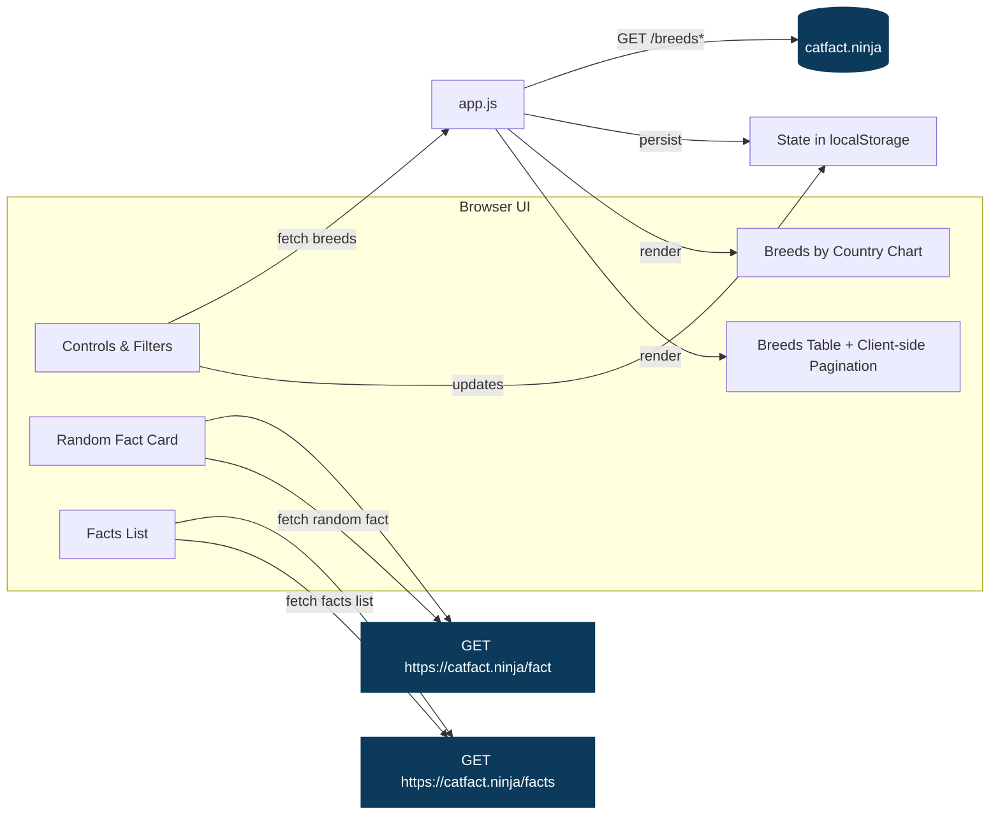

# Cat Breeds Visualizer

A lightweight, static web app to fetch and visualize cat breed data and facts from catfact.ninja.

Features
- Fetch breeds from any compatible endpoint (default: https://catfact.ninja/breeds)
- Interactive table: sorting, fuzzy filters (breed, country), global search, advanced per-field filters with AND/OR logic
- Client-side pagination for large tables (rows per page selector)
- Chart: Breeds by Country (Chart.js)
- CSV export for breeds and facts
- Random Cat Fact with optional auto-refresh and max fact length
- Facts list (GET /facts) with pagination, max_length filter, and CSV export
- Settings persisted locally (URL, headers, filters, sort, pagination, auto-refresh)

Quick start
- Option A: Open index.html directly in a modern browser.
- Option B: Serve locally (recommended for GitHub Pages parity):
  - Python: `python3 -m http.server 8080`
  - Node (if installed): `npx http-server -p 8080`
  - Then open http://localhost:8080/

How to use
1) Random Cat Fact (top of page)
   - Max fact length (characters): limits the length returned by GET /fact
   - Auto-refresh: check to refresh every N seconds; adjust the interval as needed
   - Refresh Fact: fetch a new random fact immediately
2) Controls
   - Request URL: defaults to https://catfact.ninja/breeds?limit=1; paste another compatible URL if desired
   - Use 50 per page: convenience to set limit=50 on the breeds URL
   - Accept header: defaults to application/json
   - Limit: updates the limit query parameter for the Request URL
   - Load Data: fetch the breeds data
3) Filters
   - Filter Breed, Filter Country: case-insensitive, typo-tolerant (fuzzy) substring match
   - Search all columns: searches breed, country, origin, coat, pattern (fuzzy)
   - Advanced filters: per-field contains with AND or OR logic
   - Active filters: chips show what’s active; click × to clear a filter, or use Clear All Filters
4) Breeds table
   - Click a column header to sort; click again to toggle ascending/descending
   - Rows per page: select 10/25/50/100; use Prev/Next to page locally
   - Export CSV: downloads the currently filtered rows (all pages, not just the visible slice)
5) Chart
   - Breeds by Country bar chart updates to reflect the currently filtered set
6) Facts list
   - Limit and max_length control GET /facts query
   - Load Facts: fetch facts for the current page
   - Prev/Next to page through results; Export CSV for the current page

Notes
- Some API responses include pagination metadata (current_page, last_page, total). The app surfaces that for the breeds request if available.
- App state is saved to localStorage under the key cbv_state.

Architecture (Mermaid)

Project structure
- index.html — markup and controls
- styles.css — dark theme, layout, table, chart, and control styling
- app.js — data fetching, filtering, sorting, pagination, chart rendering, CSV export, persistence

Development
- No build step; pure HTML/CSS/JS
- Dependencies: Chart.js via CDN only
- Works on any modern browser with network access to catfact.ninja

GitHub setup
1) Initialize and commit
   - `git init`
   - `git add .`
   - `git commit -m "Initial commit: Cat Breeds Visualizer"`
2) Create a GitHub repo and push (choose one):
   - Using GitHub CLI:
     - `gh repo create cat-breeds-visualizer --source=. --public --remote=origin --push`
   - Manual:
     - Create an empty repo on GitHub
     - `git branch -M main`
     - `git remote add origin <your repo url>`
     - `git push -u origin main`
3) GitHub Pages (optional)
   - On GitHub: Settings → Pages → Build and deployment
   - Source: Deploy from a branch
   - Branch: main; Folder: /(root)
   - Save. After a few minutes, your site will be available at the Pages URL.

Troubleshooting
- Network/CORS: catfact.ninja supports cross-origin requests; if a corporate proxy blocks it, try another network.
- Empty results: Increase the limit or clear filters; click Use 50 per page or raise the Limit.
- Very large datasets: Use client-side pagination in the Breeds section to keep the UI responsive.

License
- This project is provided as-is. Add your preferred LICENSE file if you plan to publish broadly.

